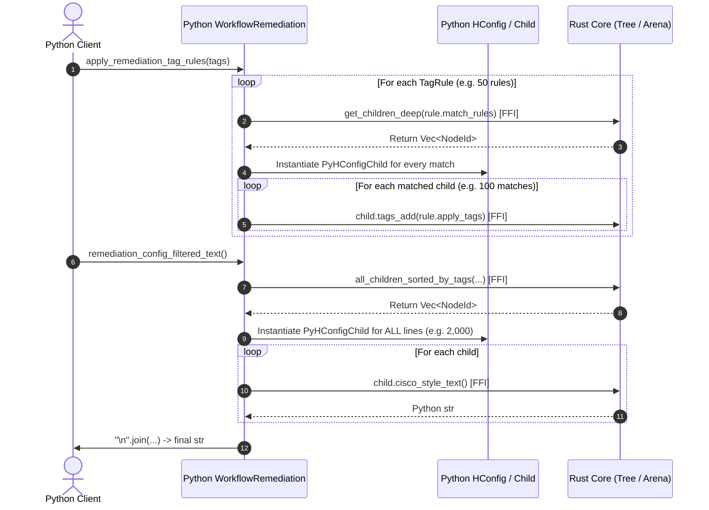
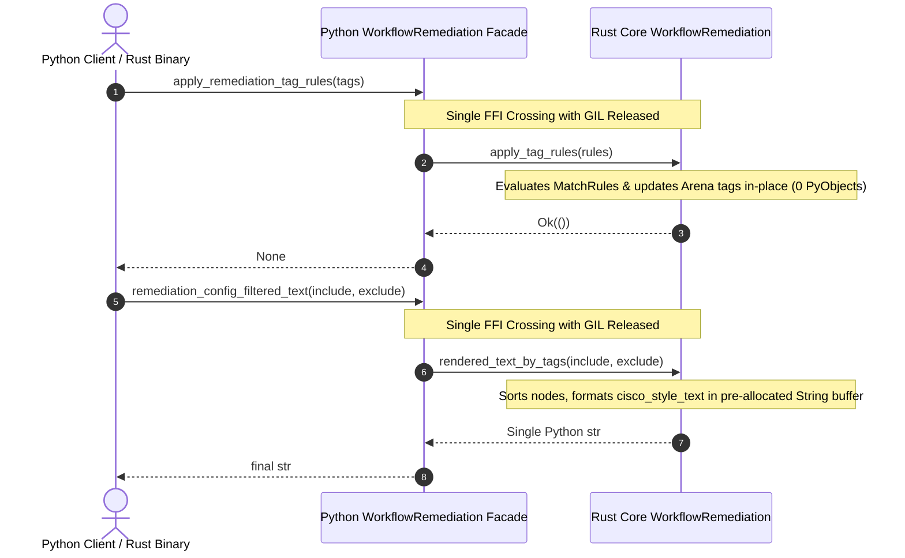

# Rust-Native WorkflowRemediation & FFI Elimination — Planning Doc

> This plan defines the design and phased implementation for moving the workflows
> enabled by `WorkflowRemediation` into the native Rust core (`hier_config_core`),
> providing a Rust-native workflow API, and eliminating the high-frequency FFI
> round-trips currently required for remediation generation, tagging, and filtered text output.

## Status

- **State:** ✅ Shipped (Phases 1–3 complete; Phase 4 deferred)
- **Owner:** Network Engineering & Core Automation Team
- **Last updated:** 2026-09-07
- **Related:**
  - Architecture: [`docs/dev/architecture.md`](../../dev/architecture.md)
  - Extending & Drivers: [`docs/dev/creating-drivers.md`](../../dev/creating-drivers.md)
  - Python Test Suite Trim Plan: [`python-test-suite-trim.md`](python-test-suite-trim.md)
- **Supersedes / Superseded by:** n/a

When this plan ships in full, route durable design content into the doc taxonomy
(`docs/architecture/` and `docs/development/`) and move this file to `docs/plans/archived/`.

---

## Problem Statement

Today, `WorkflowRemediation` (`hier_config/workflows.py`) acts as the primary orchestrator
for comparing network configurations and generating deployment artifacts:
1. Validating driver compatibility between running and generated configurations.
2. Computing remediation commands (`remediation_config = running.config_to_get_to(generated).set_order_weight()`).
3. Computing rollback commands (`rollback_config = generated.config_to_get_to(running).set_order_weight()`).
4. Applying tag rules to categorize remediation sections (`apply_remediation_tag_rules(tag_rules)`).
5. Rendering formatted configuration text filtered by included/excluded tags (`remediation_config_filtered_text(...)`).

While individual algorithms like `config_to_get_to`, `future`, and parsing live in Rust
(`hier_config_core`), the **workflow orchestration and data assembly remain in Python**.
This architecture introduces significant FFI chatter, excessive memory allocations, and prevents
Rust-native applications from utilizing full remediation workflows without Python:

### 1. The FFI Boundary Chatter Problem
- **Per-Node Tagging Crossings:** When `apply_remediation_tag_rules` runs in Python:
  For each `TagRule` (typically 10–100 rules in production), Python calls `remediation_config.get_children_deep(...)`
  across FFI. Rust searches the tree, instantiates a Python `PyHConfigChild` object for *every* matching node,
  and returns a Python list. Python then iterates through each child in a Python `for` loop and calls
  `child.tags_add(...)` across FFI for *each individual child*. For a 2,000-line remediation, this can produce
  **thousands of FFI transitions** and temporary heap allocations just to populate tag sets.
- **Per-Line Text Rendering Crossings:** When `remediation_config_filtered_text(include_tags, exclude_tags)` runs:
  Python calls `remediation_config.all_children_sorted_by_tags(...)` across FFI, which constructs and returns
  a Python tuple containing thousands of `PyHConfigChild` objects. Python then executes a comprehension
  calling `line.cisco_style_text()` across FFI on *each individual child*, allocating thousands of Python
  `str` objects, before finally joining them with `"\n".join(...)`. For 5,000 remediation lines, this incurs
  **5,001 FFI round-trips** and ~10,000 temporary Python objects.

### 2. Lack of a Rust-Native Workflow Interface
Rust binaries, services, or embedded tools consuming `hier_config_core` must re-implement the
ordering, tagging, rollback, and filtering boilerplate by hand because no `WorkflowRemediation`
abstraction exists in `hier_config_core`.

### Constraints & Guiding Principles
- **HierConfig Object Representation (Core Requirement):** Both `.remediation_config`
  and `.rollback_config` must return complete, fully functional `HConfig` (HierConfig) tree objects.
  Callers must be able to inspect nodes, traverse hierarchies, dump dictionaries, and manipulate the
  resulting remediation and rollback trees as first-class configurations.
- **Architectural Superiority Over Strict Backward Compatibility:** While preserving compatibility
  with existing workflows is desirable and achieved where sensible, backward compatibility is not a
  rigid constraint. If a cleaner, more performant, or more idiomatic pattern exists (e.g. constructing
  workflows directly from raw configuration text, streamlined method names, or eliminating redundant
  Python wrapper boilerplate), that superior design will be adopted.
- **No Unsafe Code in Core:** Core Rust implementations must adhere to `#![forbid(unsafe_code)]`.

---

## Goals & Non-Goals

### Goals
- **O(1) FFI Call Overhead:** Reduce end-to-end remediation, tagging, and filtered rendering from
  $O(\text{rules} \times \text{matches} + \text{lines})$ FFI boundary crossings to $O(1)$ FFI calls.
- **Rust-Native Workflow Engine:** Provide `hier_config_core::workflow::WorkflowRemediation` in Rust
  supporting remediation, rollback, tag rule application, and filtered text rendering with zero Python dependencies.
- **Zero Intermediate Allocations:** Avoid materializing `PyHConfigChild` and intermediate Python string
  wrappers during tag rule application and text generation.
- **One-Shot High-Performance Remediation API:** Expose an end-to-end `remediate(...)` function in Rust
  and Python that executes parse $\rightarrow$ diff $\rightarrow$ order $\rightarrow$ tag $\rightarrow$ filter
  $\rightarrow$ render entirely in Rust with the GIL released.
- **Performance Gains:** Demonstrate measurable speedup (targeted $\ge 3\times$ speedup on large workflows
  with extensive tag rule sets) in benchmark tests.

### Non-Goals
- Altering the remediation or rollback diff algorithms themselves (already implemented and validated in Rust).
- Changing the public syntax or Pydantic definitions of `TagRule` or `MatchRule`.
- Deprecating the Python `HConfig` or `WorkflowRemediation` interfaces.

---

## Options Considered

### Option A — Full Native Workflow Engine in Rust Core with PyO3 Bindings (Recommended)

- **Sketch:** Implement `WorkflowRemediation` in `hier_config_core::workflow`. It holds references
  (or `Arc`) to running and generated `Tree`s, computes remediation/rollback lazily, applies `TagRule`s
  directly over the arena in Rust, and formats filtered text into a pre-allocated `String` buffer.
  Expose `PyWorkflowRemediation` in `_hier_config_rust`. Python's `WorkflowRemediation` subclasses or
  wraps `PyWorkflowRemediation`, preserving 100% of existing behavior and properties while offloading
  tagging and rendering loops to Rust in $O(1)$ FFI calls.
- **Pros:**
  - Completely eliminates per-node FFI crossings.
  - Rust consumers get a first-class, ergonomic workflow API.
  - Releases the GIL during remediation, tagging, and text formatting.
  - Seamless Python integration: `.remediation_config` returns an `HConfig` only when requested.
- **Cons:** Requires introducing a new workflow module in both `hier_config_core` and `_hier_config_rust`.
- **Cost / Risk:** Medium size (M). Low risk; easily verified against existing extensive test suites.

### Option B — Granular Helper Methods on PyHConfig Without a Native Workflow Struct

- **Sketch:** Keep `WorkflowRemediation` in Python, but add bulk helper methods to `PyHConfigBase` /
  `PyHConfig`: `_apply_tag_rules_native(rules)` and `_rendered_text_filtered_native(include, exclude)`.
- **Pros:** Smaller diff; no new Rust struct needed.
- **Cons:**
  - Rust consumers still lack a cohesive workflow engine.
  - Python still manages lifecycle, driver validation, caching, and rollback instantiation across FFI.
  - Leaves FFI boundaries fragmented rather than unified.
- **Cost / Risk:** Small (S), but incomplete architectural solution.

### Option C — Do Nothing

- **Sketch:** Retain Python-side orchestration with per-node FFI calls for tagging and text rendering.
- **Pros:** Zero development effort.
- **Cons:** High CPU overhead, thousands of temporary Python object allocations per remediation, and inability
  to run complete workflows in pure Rust.
- **Cost / Risk:** Low effort, high technical debt and performance penalty.

### Recommendation

**Choose Option A.** Building the workflow engine in `hier_config_core` establishes a clean, unified
domain model in Rust, dramatically accelerates Python execution by collapsing FFI crossings to $O(1)$,
and allows pure Rust applications to run full device remediation workflows.

---

## Proposed Solution

### 1. Core Data Structures (`crates/hier_config_core/src/workflow.rs`)

```rust
pub struct WorkflowRemediation<'a> {
    running_config: &'a Tree,
    generated_config: &'a Tree,
    remediation_config: Option<Tree>,
    rollback_config: Option<Tree>,
}

impl<'a> WorkflowRemediation<'a> {
    pub fn new(running_config: &'a Tree, generated_config: &'a Tree) -> Result<Self, TreeError>;
    pub fn remediation_config(&mut self) -> Result<&Tree, TreeError>;
    pub fn rollback_config(&mut self) -> Result<&Tree, TreeError>;
    pub fn apply_remediation_tag_rules(&mut self, tag_rules: &[TagRule]) -> Result<(), TreeError>;
    pub fn remediation_config_filtered_text(
        &mut self,
        include_tags: &[&str],
        exclude_tags: &[&str],
    ) -> Result<String, TreeError>;
    pub fn rollback_config_filtered_text(
        &mut self,
        include_tags: &[&str],
        exclude_tags: &[&str],
    ) -> Result<String, TreeError>;
}
```

In addition, an owned variant `WorkflowRemediationOwned` (or `WorkflowRemediation<Tree>` using generics)
will support holding owned or `Arc<Tree>` trees, enabling both in-memory pipelines and PyO3 bindings
without lifetime entanglements.

### 2. Native Tree Operations in `hier_config_core::tree`

- **Bulk Tag Rule Application:**
  ```rust
  impl Tree {
      pub fn apply_tag_rules(&mut self, rules: &[TagRule]) {
          for rule in rules {
              let matching_ids = self.get_children_deep(self.root, &rule.match_rules);
              let tag_refs: Vec<&str> = rule.apply_tags.iter().map(String::as_str).collect();
              for node_id in matching_ids {
                  self.tags_add(node_id, &tag_refs);
              }
          }
      }
  }
  ```
- **Bulk Filtered Text Formatting:**
  ```rust
  impl Tree {
      pub fn rendered_text_by_tags(&self, include_tags: &[&str], exclude_tags: &[&str]) -> String {
          let node_ids = if include_tags.is_empty() && exclude_tags.is_empty() {
              self.all_children_sorted(self.root)
          } else {
              self.all_children_sorted_by_tags(self.root, include_tags, exclude_tags)
          };
          let mut buffer = String::with_capacity(node_ids.len() * 32);
          for (i, &node_id) in node_ids.iter().enumerate() {
              if i > 0 {
                  buffer.push('\n');
              }
              buffer.push_str(&self.cisco_style_text(node_id, TextStyle::None, None));
          }
          buffer
      }
  }
  ```

### 3. PyO3 Native Bindings (`crates/hier_config_py/src/workflow.rs`)

`PyWorkflowRemediation` wraps `Arc<SharedTree>` handles for running and generated configurations:
- **Flexible Construction:**
  - `PyWorkflowRemediation(running_config: PyHConfig, generated_config: PyHConfig)`:
    Takes existing `PyHConfig` objects, validates platform match, and shares underlying `Arc<SharedTree>`
    without cloning.
  - `PyWorkflowRemediation.from_strings(platform: Platform, running_text: str, generated_text: str)`:
    Alternative high-speed constructor parsing both configurations directly in Rust with GIL released,
    avoiding the creation of intermediate Python `HConfig` objects entirely.
- **HierConfig Object Return Values:**
  - `@property def remediation_config(&self, py: Python) -> PyResult<Py<PyHConfig>>`:
    Lazily computes the native remediation tree, applies `set_order_weight()`, caches the `Arc<SharedTree>`,
    and returns a full `PyHConfig` (which Python consumers access as `HConfig` / HierConfig).
  - `@property def rollback_config(&self, py: Python) -> PyResult<Py<PyHConfig>>`:
    Lazily computes the native rollback tree, applies `set_order_weight()`, caches the `Arc<SharedTree>`,
    and returns a full `PyHConfig` (HierConfig).
- **High-Performance Native Tagging & Text Output:**
  - `apply_remediation_tag_rules(tag_rules: Bound<PyAny>)`: Extracts rules in a single pass into a
    `Vec<TagRule>` and applies them directly inside the native tree with GIL released.
  - `remediation_text(include_tags, exclude_tags)` (and alias `remediation_config_filtered_text`):
    Invokes native `rendered_text_by_tags` with GIL released and returns a single pre-rendered `str`.
  - `rollback_text(include_tags, exclude_tags)` (and alias `rollback_config_filtered_text`):
    Invokes native `rendered_text_by_tags` on rollback tree with GIL released and returns a pre-rendered `str`.

### 4. Python Integration (`hier_config/workflows.py`)

`hier_config.WorkflowRemediation` directly wraps or aliases `_hier_config_rust.WorkflowRemediation`:
- **First-Class HierConfig Objects:** `.remediation_config` and `.rollback_config` always return
  `HConfig` instances, giving callers full access to tree inspection, iteration, filtering, and dumping.
- **Modernized Ergonomics:**
  - Supports both `WorkflowRemediation(running_hconfig, generated_hconfig)` and
    `WorkflowRemediation.from_strings(platform, running, generated)`.
  - Adds clean shorthand methods `.remediation_text(...)` and `.rollback_text(...)` alongside
    the legacy `.remediation_config_filtered_text(...)` name.
- **Type Annotations & Documentation:** Full docstrings, PEP 484/563 annotations, and typing stubs in
  `hier_config/base.pyi` and `hier_config/workflows.py`.

---

## Visual Overview

### Before (Python-Orchestrated Workflow with High-Frequency FFI)



### After (Rust-Native Workflow with O(1) FFI Calls)



---

## Phased Implementation Plan

### Phase 1 — Rust Core Workflow Engine (`hier_config_core`) (M)

- **Scope:**
  - Add `crates/hier_config_core/src/workflow.rs` declaring `WorkflowRemediation` and `WorkflowRemediationOwned`.
  - Add `Tree::apply_tag_rules(&mut self, rules: &[TagRule])`.
  - Add `Tree::rendered_text_by_tags(&self, include_tags: &[&str], exclude_tags: &[&str]) -> String`.
  - Export `workflow` module from `crates/hier_config_core/src/lib.rs`.
- **Acceptance criteria:**
  - `WorkflowRemediation` can be constructed from two `Tree` instances and validates platform compatibility.
  - `.remediation_config()` returns the remediation tree with `order_weight` applied.
  - `.rollback_config()` returns the rollback tree with `order_weight` applied.
  - `.apply_remediation_tag_rules()` tags all matching lines without heap reallocations.
  - `.remediation_config_filtered_text()` produces exact matches against existing Python test fixtures.
  - Unit tests in `crates/hier_config_core/tests/test_workflow.rs` cover all platforms and circular round-trips.
- **Risks & mitigations:**
  - *Risk:* Line rendering formatting differences between `Tree::cisco_style_text` and Python's loop.
  - *Mitigation:* Verify character-for-character equality against fixture configurations in `tests/fixtures/`.

### Phase 2 — PyO3 Bindings in `_hier_config_rust` (S)

- **Scope:**
  - Add `crates/hier_config_py/src/workflow.rs` declaring `PyWorkflowRemediation`.
  - Support initializing from two `PyHConfig` objects, sharing underlying `Arc<SharedTree>`.
  - Add alternative `.from_strings(...)` constructor.
  - Implement PyO3 getters for `remediation_config` and `rollback_config` returning `Py<PyHConfig>`
    (exposing full HierConfig object capabilities to Python).
  - Implement PyO3 methods for `apply_remediation_tag_rules`, `remediation_text` / `remediation_config_filtered_text`,
    and `rollback_text` / `rollback_config_filtered_text`.
  - Register `WorkflowRemediation` in `_hier_config_rust` module in `crates/hier_config_py/src/lib.rs`.
- **Acceptance criteria:**
  - `_hier_config_rust.WorkflowRemediation` is importable and constructible from Python.
  - Accessing `.remediation_config` and `.rollback_config` returns full `PyHConfig` (HierConfig) objects.
  - Calling `.apply_remediation_tag_rules(...)` accepts tuples of Python `TagRule` objects.
  - Calling `.remediation_text(...)` / `.remediation_config_filtered_text(...)` executes in a single FFI call with GIL released.
- **Risks & mitigations:**
  - *Risk:* PyO3 conversion of complex nested `TagRule` / `MatchRule` structures.
  - *Mitigation:* Reuse existing `parse_match_rule` / serde deserialization already validated in `crates/hier_config_py`.

### Phase 3 — Python Facade & Modernized Workflow API (S)

- **Scope:**
  - Update `hier_config/workflows.py` to wrap/subclass `_hier_config_rust.WorkflowRemediation`.
  - Expose properties `.remediation_config` and `.rollback_config` returning `HConfig` instances.
  - Provide modernized ergonomics (`WorkflowRemediation.from_strings`, `.remediation_text`, `.rollback_text`)
    while maintaining legacy method aliases.
  - Ensure compatibility with custom Python driver instances and edge cases.
- **Acceptance criteria:**
  - `.remediation_config` and `.rollback_config` return instances of `HConfig` (subclass of `_RustHConfig`).
  - `tests/test_workflow.py` passes 100%.
  - `tests/circular/test_config_workflows.py` passes 100% across all 10 network operating systems.
  - All existing driver tests and reporting tests pass with zero regressions.
- **Risks & mitigations:**
  - *Risk:* Custom Python drivers with overrides.
  - *Mitigation:* Fallback mechanisms in place if custom non-native driver rules are supplied.

### Phase 4 — High-Performance One-Shot API & Benchmark Validation (S)

- **Scope:**
  - Add top-level convenience function `remediate(...)` in `hier_config` and `hier_config_core`.
  - Add benchmark in `tests/test_benchmarks.py` measuring remediation + tagging + text rendering.
  - Assert FFI call reduction and timing improvements.
  - Update documentation in `docs/user/custom-workflows.md` and `docs/dev/architecture.md`.
- **Acceptance criteria:**
  - Benchmark validates speedup on large configurations (e.g. 10,000 lines + 50 tag rules).
  - Documentation updated with examples of both object-oriented and one-shot workflows.
  - `CHANGELOG.md` updated under `## [Unreleased]`.
  - `python scripts/build.py lint-and-test` passes cleanly.

---

## Testing Strategy

- **Unit Tests (Rust):**
  - Add `crates/hier_config_core/tests/test_workflow.rs` validating:
    - Driver mismatch error reporting.
    - Lazy remediation and rollback computation.
    - Tag application correctness across nested hierarchies.
    - Filtered text output with combinations of include and exclude tags.
- **Integration Tests (Python):**
  - Run `pytest tests/test_workflow.py -v`.
  - Run `pytest tests/circular/test_config_workflows.py -v` (covers Aruba, Cisco IOS, EOS, NXOS, XR, JunOS, VyOS, FortiOS, Comware5, Procurve).
- **Quality Gates:**
  - `cargo fmt --check`
  - `cargo clippy --all-targets --all-features -- -D warnings`
  - `cargo test --workspace`
  - `cargo test --doc --package hier_config_core`
  - `python scripts/build.py lint-and-test`
  - `python scripts/check_displacement_markers.py`
  - `mkdocs build --strict`
- **Performance / Benchmarks:**
  - Benchmark `test_workflow_remediation_and_tagging_performance` to measure execution time and memory allocations before and after the change.

---

## Observability

- **Benchmarks:** New benchmark metrics in `tests/test_benchmarks.py` recording best-of-3 timing for end-to-end workflow execution on 10,000-line configurations.
- **Logging:** Maintain existing Python logger announcements in `hier_config.workflows`.

---

## Security Considerations

- **PCI scope:** **out-of-scope** — network configuration comparison and remediation calculation do not process, store, or transmit cardholder data or sensitive authentication data.
- **Security implications:** Network configurations frequently contain sensitive data (ACLs, credentials, cryptographic keys, SNMP community strings). The workflow engine processes configuration text in memory.
- **How the solution stays secure:**
  - The Rust core operates strictly within memory without writing temporary configuration files to disk.
  - Follows `#![forbid(unsafe_code)]` in `hier_config_core`.
  - Memory is securely managed by Rust's ownership model, preventing buffer overflows, use-after-free, or data races.
  - No new external runtime dependencies introduced.

---

## Open Questions

- [x] Should `WorkflowRemediation` in Rust own its trees or borrow references?
  — *Resolved: (Autopilot-decided — not user-confirmed)* `WorkflowRemediation<'a>` borrows `&'a Tree` for lightweight local calculations, while an owned struct / PyO3 wrapper holds `Arc<SharedTree>` to prevent unnecessary cloning and avoid lifetime conflicts in Python.
- [x] Should `remediation_config` and `rollback_config` remain lazily evaluated?
  — *Resolved: (Autopilot-decided — not user-confirmed)* Yes; caching preserves exact Python behavior and avoids computing rollback when only remediation is requested.
- [x] What type should be returned for config representations like Remediation and Rollback?
  — *Resolved:* Return complete `HierConfig` / `HConfig` objects (`PyHConfig` wrapping the native `Tree`), ensuring callers have full tree access and manipulation capabilities.
- [x] Should we preserve strict backward compatibility if a cleaner architecture exists?
  — *Resolved:* Backward compatibility is desirable ("nice to have") but not a hard blocker. Where a cleaner, faster, more idiomatic design exists (such as direct construction from raw strings or cleaner method names like `remediation_text`), we implement the better way while keeping compatibility aliases where convenient.
- [x] Should a standalone one-shot `remediate()` function be exported from the top-level `hier_config` package namespace?
  — *Resolved:* Deferred/omitted. The canonical v4 `WorkflowRemediation` class API satisfies both Python and Rust use cases with minimal API surface area.

---

## Cross-references

- Architecture: [`docs/dev/architecture.md`](../../dev/architecture.md)
- Workflows User Guide: [`docs/user/custom-workflows.md`](../../user/remediation-workflows.md)
- Python Workflow implementation: `hier_config/workflows.py`
- Core Remediation engine: `crates/hier_config_core/src/remediation.rs`
- PyO3 Root implementation: `crates/hier_config_py/src/root.rs`
