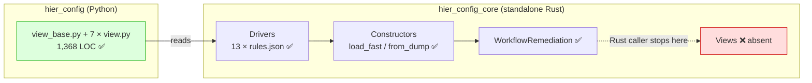
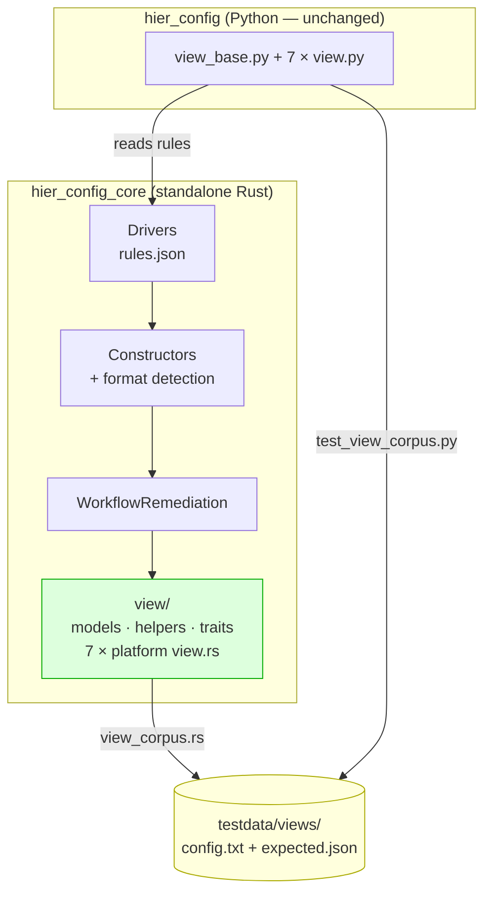

# Rust-Native Drivers, Constructors & Views — Planning Doc

> **Temporary document.** On ship, the durable content routes to
> `docs/dev/architecture.md` (design + ownership boundary) and
> `docs/dev/extending.md` (how to add a platform view), then this plan is
> archived.

## Status

- **Status:** Implemented (Phases 1-6 complete; full gate green)
- **Owner:** rust-rewrite branch
- **Date:** 2025-06-09
- **Related:**
  - `docs/plans/rust-native-workflow-remediation.md` (predecessor — moved the
    workflow engine into Rust)
  - `docs/plans/rust-rewrite-onto-next.md` (predecessor — reconciled the rewrite
    onto `upstream/next`)
  - Commit `abf3d6f` `refactor(rust): retire the unfinished native view subsystem`
    (the failed first attempt this plan supersedes)

## Problem Statement

`hier_config_core` is intended to be usable as a **standalone Rust crate**, not
merely as the engine behind a Python extension module. Today it is not. A pure
Rust consumer can parse a config, build a driver, and compute a remediation —
but cannot ask the library a single semantic question about the device.

Concretely, the three areas named in the request are in very different states:

### 1. Drivers — already Rust-native (verify, don't rewrite)

All 13 platform drivers already live in Rust. Each
`crates/hier_config_core/src/platforms/<name>/rules.json` holds that platform's
rule set (2,482 lines total), dispatched by `rules_json_for_platform()` in
`platforms/mod.rs`. Post-load callbacks, negation swapping, and sectional-exit
defaults are Rust functions.

The direction of authority is already correct and documented in
`hier_config/platforms/driver_base.py::_load_platform_data`:

> The JSON embedded in the Rust core is the single source of truth for the
> built-in platforms, so Python and Rust cannot drift apart.

A survey confirms **no Python driver defines rules inline** — every
`hier_config/platforms/*/driver.py` reads the Rust JSON. The remaining work here
is verification and ergonomics, not conversion.

### 2. Constructors — mostly Rust-native, missing the convenience layer

`hier_config_core` exports `Tree::new`, `Tree::for_platform`, `load_fast`,
`load_fast_with_callbacks`, `load_from_str`, `load_from_str_with_callbacks`,
`from_dump`, `config_preprocessor`, and `convert_to_set_commands`. A Rust caller
can therefore build any tree — but only by hand-assembling two or three calls,
and with no equivalent of Python's structured-format detection (which rejects
JSON/XML text passed to a line-oriented loader with an actionable error).

`hier_config/constructors.py` exposes ten entry points. Nine have a Rust
counterpart in some form. The tenth, `get_hconfig_view()`, has none — because
views do not exist in Rust at all.

### 3. Views — entirely absent from Rust

This is the real gap. The view layer is how callers ask semantic questions:
*what interfaces exist, what are their IP addresses, which are bundle members,
what is the native VLAN, is NAC enabled, what is the hostname.* It is 1,368
lines of Python across `platforms/view_base.py` (437), `platforms/models.py`
(47), and seven platform `view.py` files. There is **zero** Rust equivalent.

A first attempt existed and was deleted in `abf3d6f`. Its stated failure mode
matters, because this plan must not repeat it:

> The Rust port never got past stubs (66 unimplemented methods for Arista, 38
> for generic) and nothing — Python or Rust — imported it, so keeping it only
> invited drift between two view implementations.

Two failures, not one: the port was **incomplete**, and it was **unverified**.
Any replacement must be finished and must be mechanically checked against the
Python behaviour on every CI run.

### Constraints & Guiding Principles

- **No behaviour change on the Python side.** 1,050 Python tests pass today,
  277 of them covering views. This work must not alter a single expected value.
- **No new runtime dependencies** (repo hard rule). Rust-side dev/impl
  dependencies are already fixed: `regex`, `fancy-regex`, `rustc-hash`, `serde`,
  `serde_json`. IPv4 handling must use `std::net`, not a new crate.
- **Strict lints stay strict.** The workspace denies `clippy::pedantic`,
  `cognitive_complexity`, `unimplemented`, `todo`, `shadow_unrelated`,
  `use_self`, `missing_const_for_fn`, and more. `unimplemented!()` is a compile
  error — the exact escape hatch the retired attempt leaned on is unavailable,
  which is a feature.
- **No inline regex.** `crates/hier_config_core/tests/no_inline_regex.rs` fails
  the build on any `Regex::new` under `src/`, including in `#[cfg(test)]`. Use
  `crate::regex_cache::regex(..)`.
- **TDD is a hard rule.** Failing test first, confirmed failing for the right
  reason, then minimal implementation.

## Goals & Non-Goals

### Goals

1. A pure-Rust consumer can, with no Python present, select a built-in driver
   for any of the 13 platforms, load a config, compute a remediation and
   rollback, and **query a semantic view** of the device.
2. Views are implemented natively in Rust for the seven platforms that have a
   Python view today (arista_eos, aruba_aoscx, cisco_ios, cisco_nxos, cisco_xr,
   generic, hp_procurve).
3. Rust and Python view results are proven identical by a **shared,
   language-neutral corpus** executed by both test suites — the same anti-drift
   mechanism already used for the remediation engine (`testdata/cases/`).
4. Ergonomic one-call constructors exist in Rust, including structured-format
   rejection with the same actionable error text Python emits.
5. Driver faithfulness is asserted, not assumed: a Rust test proves every
   platform's rules load and every documented post-load callback is reachable.

### Non-Goals

- **Not** rewriting `hier_config/platforms/*/view.py` to delegate to Rust. That
  is a much larger, riskier change; see Option A below and the Open Question on
  long-term ownership.
- **Not** porting `hier_config/formats.py` (JSON / XML / NETCONF / gNMI
  serialization). It was not requested, and `root.rs` deliberately delegates
  those four methods back to Python.
- **Not** adding views for the six platforms that have no Python view
  (fortinet_fortios, hp_comware5, huawei_vrp, juniper_junos, nokia_srl, vyos).
  Inventing a Rust-only surface with no Python counterpart would create exactly
  the unverifiable code `abf3d6f` deleted.
- **Not** changing any Python public API, return type, or expected value.

## Options Considered

### Option A — Rust owns views; Python delegates to it

Port the view layer to Rust and reduce `hier_config/platforms/*/view.py` to thin
PyO3-backed shims, mirroring how driver rules JSON already works.

- **Pro:** literally one implementation; drift is impossible by construction.
- **Con:** churns 1,368 lines of working, fully-tested Python; every property
  becomes an FFI call, and lazy generator semantics
  (`interface_views`, `ipv4_interfaces`) are awkward and slow across the
  boundary; rich return types (`IPv4Interface`, frozen Pydantic `StackMember`,
  `str`-valued enums) must be reconstructed on the Python side anyway, so much
  of the Python code survives regardless.
- **Con:** highest risk to the 277 passing view tests, for zero user-visible
  gain.

### Option B — Rust implements views natively; a shared corpus enforces parity (Recommended)

Implement the view layer in Rust as a first-class native API. Add
`testdata/views/` — config text plus expected view output as JSON — and run it
from **both** `crates/hier_config_core/tests/view_corpus.rs` and
`tests/native/test_view_corpus.py`. Any divergence fails CI in both languages.

- **Pro:** directly satisfies "usable as a Rust library" with idiomatic Rust
  types and no FFI in the hot path.
- **Pro:** reuses the anti-drift mechanism the repo already trusts for the
  remediation engine, rather than inventing one.
- **Pro:** zero risk to existing Python behaviour; the Python view layer is not
  touched.
- **Pro:** incremental — each platform lands green on its own.
- **Con:** two implementations exist. Mitigated, not eliminated, by the corpus:
  drift is *detected mechanically* rather than *prevented structurally*.

### Option C — Do nothing

Leave `hier_config_core` engine-only.

- **Pro:** no work, no risk.
- **Con:** fails the stated requirement. A Rust consumer can compute a diff but
  cannot ask what an interface is, which rules out the crate for most real
  network-automation use.

### Recommendation

**Option B.**

Option A is the theoretically cleaner end state and the one `abf3d6f`'s
reasoning points toward, but it pays a large, risky Python refactor for a
property — no-drift — that Option B achieves to within one CI run at a fraction
of the cost. The decisive argument is that `abf3d6f` did not fail because two
implementations existed; it failed because the second one was **unfinished and
untested**. Option B fixes precisely those two defects: `unimplemented!()` is a
compile error under this workspace's lint policy, and the corpus makes the port
continuously verified rather than aspirational.

Option A remains the sensible follow-up once the Rust view has proven itself in
production. Recorded as an Open Question rather than foreclosed.

## Proposed Solution

### 1. View models (`crates/hier_config_core/src/view/models.rs`)

Faithful Rust equivalents of `hier_config/platforms/models.py`:

- `NACHostMode` — unit enum, `as_str()` yielding `single-host`, `multi-domain`,
  `multi-auth`, `multi-host` (the Python values, not the variant names).
- `InterfaceDot1qMode` — `Access`, `Tagged`, `TaggedAll`. **Verified against the
  live enum:** Python declares `class InterfaceDot1qMode(str, Enum)` with
  `auto()`, so the values are `"1"`, `"2"`, `"3"` — *not* the lowercased member
  names. Transcribing the names would be a silent corpus mismatch.
- `InterfaceDuplex` — `Auto`, `Full`, `Half`.
- `StackMember { id: u32, priority: u32, mac_address: Option<String>, model: String }`.
- `Vlan { id: u32, name: Option<String> }`.
- `Ipv4Interface { address: Ipv4Addr, prefix_len: u8 }` — a minimal local type
  built on `std::net::Ipv4Addr`, because adding an IP-network crate would breach
  the dependency rule. Provides `network()`, `netmask()`, and `Display` as
  `a.b.c.d/nn` to match Python's `IPv4Interface`.

All derive `serde::Serialize` so the corpus comparison is a plain JSON equality
check.

### 2. Shared view helpers (`crates/hier_config_core/src/view/helpers.rs`)

- `parse_ipv4_interface(words: &[&str]) -> Option<Ipv4Interface>` — the port of
  `hier_config/platforms/functions.py::parse_ipv4_interface`, handling both
  `address netmask` and `address/prefix` spellings.
- `dot1q_mode_from_vlans(...)` — the port of
  `HConfigViewBase.dot1q_mode_from_vlans`.
- Name-decomposition helpers backing `number`, `port_number`,
  `subinterface_number`, `module_number`, `parent_name`.

### 3. View traits (`crates/hier_config_core/src/view/interface.rs`, `src/view/mod.rs`)

Two traits mirroring the Python ABCs, with **default method bodies** carrying
the shared logic exactly as the Python base classes do:

- `InterfaceView` — the `ConfigViewInterfaceBase` surface plus the optional
  bundle / VLAN / NAC / physical mixin methods, expressed as `Option`-returning
  defaults so a platform opts in by overriding rather than by being forced to
  implement 46 methods. This is the specific structural fix for the retired
  attempt's 66-unimplemented-method problem.
- `ConfigView` — the `HConfigViewBase` surface: `hostname`, `interfaces`,
  `interface_views`, `ipv4_default_gw`, `vlans`, `stack_members`, `location`,
  `module_numbers`, and the derived `vlan_ids` / `interface_names_mentioned` /
  `interfaces_names` / `interface_view_by_name` / `bundle_interface_views`.

Methods that a platform genuinely cannot answer return `None` (or an empty
iterator) rather than panicking. Python's three `raise NotImplementedError`
sites (`nac_max_dot1x_clients`, `nac_max_mab_clients` on Cisco IOS, and the
`generic` view) map to `None`, and the corpus encodes that mapping explicitly.

### 4. Per-platform views (`crates/hier_config_core/src/platforms/<name>/view.rs`)

Seven implementations, each a direct transcription of its `view.py` sibling.
The logic is overwhelmingly prefix matching plus whitespace splitting, so the
transcription is mechanical and reviewable line-for-line against the Python.

`view_for_platform(platform: Platform, tree: &Tree) -> Option<Box<dyn ConfigView + '_>>`
in `view/mod.rs` is the dispatch entry point — the Rust analogue of
`constructors.get_hconfig_view()`.

### 5. Ergonomic constructors (`crates/hier_config_core/src/constructors.rs`)

One-call helpers matching `hier_config/constructors.py`, including
`detect_structured_format()` / `reject_structured_format()` so a Rust caller who
passes JSON or XML to a line loader gets the same actionable error Python emits,
rather than a silently mangled tree.

### 6. Verification

- `testdata/views/<platform>/<case>/` — `case.json` (platform), `config.txt`,
  `expected.json` (the serialized view).
- `crates/hier_config_core/tests/view_corpus.rs` — runs the corpus natively.
- `tests/native/test_view_corpus.py` — builds the same view through the Python
  layer, serializes it with the same schema, asserts equality.
- `crates/hier_config_core/tests/standalone_usage.rs` — the acceptance test for
  the whole plan: a program that uses only `hier_config_core`, for every
  platform, doing driver → load → remediate → view.

## Visual Overview

### Today — the Rust crate stops at the diff



### After — parity enforced by a shared corpus



## Phased Implementation Plan

### Phase 1 — View foundations (M)

**Scope.** `src/view/models.rs` (enums, `StackMember`, `Vlan`, `Ipv4Interface`),
`src/view/helpers.rs` (`parse_ipv4_interface`, name decomposition,
`dot1q_mode_from_vlans`), `src/view/mod.rs` module wiring, `lib.rs` re-exports.

**Acceptance criteria.**

- `cargo test --workspace` passes with unit tests covering every helper,
  including the `address netmask` and `address/prefix` forms and the malformed
  input that Python returns `None` for.
- `Ipv4Interface` renders `10.0.0.1/24` identically to Python's `IPv4Interface`
  for every address in the existing test fixtures.
- `cargo clippy --all-targets --all-features -- -D warnings` clean.

**Risks.** `InterfaceDot1qMode` uses `auto()` on a `str` Enum in Python, whose
value is the *lowercased member name*; transcribing the variant name instead
would be a silent mismatch. Pinned by an explicit test.

### Phase 2 — View traits (M)

**Scope.** `InterfaceView` and `ConfigView` traits with default bodies porting
`ConfigViewInterfaceBase`, the four mixins, and `HConfigViewBase`.

**Acceptance criteria.**

- Traits compile with no `unimplemented!()` / `todo!()` (both are deny-level
  lints, so this is enforced by the compiler).
- A test-only dummy implementor exercises every default body.
- Derived members (`vlan_ids`, `interface_names_mentioned`, `interfaces_names`,
  `interface_view_by_name`, `bundle_interface_views`) are covered.

**Risks.** Python's generator-valued properties are lazy; Rust defaults must not
accidentally force full materialization where the Python short-circuits.

**Grilled — why this succeeds where `abf3d6f` failed.** The retired attempt
required every platform to implement the union of all mixins, yielding 66
unimplemented methods for Arista whose `view.py` is only 62 lines. Here the
mixin surface is expressed as **default methods returning `None` / empty**, so a
platform implements exactly the members its Python sibling overrides — roughly
six for Arista. The 66-stub failure mode is structurally unreachable, and
`clippy::unimplemented` / `clippy::todo` are deny-level, so a stub cannot even
compile.

**Grilled — prerequisite confirmed.** The tree query API the views need already
exists natively: `Tree::get_child(parent, &MatchRule)`,
`Tree::get_children(parent, &MatchRule)`, `MatchRule::{equals, startswith,
endswith, contains, re_search}`, `Node.text`, and `Node.children`. No new tree
primitives are required, which removes the largest unknown from Phases 3–4.

### Phase 3 — Platform views, batch 1 (L)

**Scope.** `generic`, `cisco_ios`, `cisco_nxos`, `cisco_xr` — plus the corpus
harness (`testdata/views/`, `view_corpus.rs`, `test_view_corpus.py`) so the
mechanism is proven on the first batch.

**Acceptance criteria.**

- Corpus cases exist for each of the four platforms and pass in **both** Rust
  and Python.
- `pytest tests/native/test_view_corpus.py` green; `cargo test --workspace`
  green.
- No change to any existing Python test outcome (1,050 still pass).

**Risks.** The corpus schema must capture laziness-free, order-stable output;
interface ordering must be pinned to config order in both languages.

**Grilled risk — corpus self-confirmation.** A serializer tuned until it matches
Rust output would prove nothing. The Python side of the corpus must therefore be
written *mechanically from the Python view API alone* — iterate a fixed,
declared list of property names and dump whatever Python returns — and the
`expected.json` files must be generated from **Python**, then made to pass in
Rust. Never the reverse. Reviewers should check that no `expected.json` was
edited to accommodate a Rust result.

### Phase 4 — Platform views, batch 2 (L)

**Scope.** `arista_eos`, `aruba_aoscx`, `hp_procurve` — the three largest,
including `hp_procurve`'s stack-member and NAC handling.

**Acceptance criteria.**

- Corpus cases for all three pass in both languages.
- `view_for_platform()` returns `Some` for all seven ported platforms and `None`
  for the six with no Python view.

**Risks.** `hp_procurve` is the largest view (300 LOC) and the only one with a
non-trivial `stack_members` parse.

### Phase 5 — Constructors & driver assertion (S)

**Scope.** `src/constructors.rs` one-call helpers plus
`detect_structured_format` / `reject_structured_format`;
`tests/driver_faithfulness.rs` asserting all 13 platforms load their rules and
expose the expected post-load callback set.

**Acceptance criteria.**

- Error text for structured-format rejection matches Python's, asserted by a
  test that reads the Python message from the corpus.
- All 13 platforms load rules successfully from Rust with no Python present.

### Phase 6 — Standalone acceptance & docs (S)

**Scope.** `tests/standalone_usage.rs`; update `docs/dev/architecture.md` with
the ownership boundary and `docs/dev/extending.md` with "how to add a platform
view"; `CHANGELOG.md` entry.

**Acceptance criteria.**

- `standalone_usage.rs` performs driver → load → remediate → view for every
  platform using only `hier_config_core`.
- `mkdocs build --strict` clean.
- Full gate green: `cargo fmt --check`, `cargo clippy --all-targets
  --all-features -- -D warnings`, `cargo test --workspace`,
  `maturin develop --release`, `python scripts/build.py lint-and-test`, `pytest`
  (1,050 passing), performance gate unregressed.

## Testing Strategy

| Phase | Rust | Python |
|---|---|---|
| 1 | `cargo test -p hier_config_core view::models view::helpers` | — |
| 2 | `cargo test -p hier_config_core view::` | — |
| 3–4 | `cargo test --test view_corpus` | `pytest tests/native/test_view_corpus.py` |
| 5 | `cargo test --test driver_faithfulness` | `pytest tests/unit/test_constructors.py` |
| 6 | `cargo test --test standalone_usage` | `python scripts/build.py lint-and-test` |

Every phase additionally runs the full regression gate before commit:

```bash
cargo fmt --check
cargo clippy --all-targets --all-features -- -D warnings
cargo test --workspace
maturin develop --release          # only if crates/ changed
python scripts/build.py lint-and-test
pytest -m benchmark tests/benchmarks/test_perf_regression.py
```

The corpus is the load-bearing test. It is deliberately **data**, not code, so
adding a platform view means adding a directory rather than editing two test
suites — the property that keeps it from rotting.

## Observability

n/a — `hier_config_core` is an in-process library with no runtime, no I/O beyond
the caller's own strings, and no logging surface. Failures surface as `Result`
values to the caller. The observable signal for this work is CI: corpus
divergence fails both test suites with the offending platform, case, and field
named in the assertion message.

## Security Considerations

**PCI scope: out-of-scope.** `hier_config` is a text-transformation library. It
parses network device configuration text supplied by the caller and emits
remediation text; it opens no sockets, reads no credentials, touches no
cardholder data, and has no persistence layer. It may run on workstations that
manage PCI-adjacent network devices, but the library itself processes no
account data and holds no secrets. This work adds no I/O, no dependencies, and
no new external surface — it is strictly additive Rust code behind the existing
crate boundary.

Implications and stance, per the team's shared security & PCI baseline
(`security.instructions.md`, installed in `.github/instructions/` by
`sync-instructions`):

- **Untrusted input.** Views parse attacker-influenceable config text. All
  parsing is total: fallible conversions return `Option` / `Result`, never
  panic. `#![forbid(unsafe_code)]` remains in force in `hier_config_core`, and
  `panic_in_result_fn` is a deny-level lint. Integer parses that Python would
  let raise are mapped to `None`.
- **Denial of service.** No unbounded recursion or backtracking is introduced.
  Regexes go through `crate::regex_cache`, and the `no_inline_regex` test blocks
  ad-hoc patterns that could smuggle in a catastrophic-backtracking expression.
- **Supply chain.** Zero new dependencies. `Ipv4Interface` is implemented on
  `std::net::Ipv4Addr` specifically to avoid pulling an IP-network crate.
- **Secrets.** Device configs routinely contain hashed credentials and SNMP
  community strings. Views only read and echo text the caller already holds; no
  new logging, serialization to disk, or network egress is added. Corpus
  fixtures must use synthetic, non-routable addresses and placeholder secrets —
  enforced at review.

## Open Questions

- [ ] Should the Python view layer eventually delegate to the Rust
      implementation (Option A), collapsing to a single implementation once the
      Rust view has soaked? *Autopilot-decided — not user-confirmed:* deferred;
      Option B ships first, with the corpus as the drift guard.
- [ ] Should the six platforms with no Python view (fortinet_fortios,
      hp_comware5, huawei_vrp, juniper_junos, nokia_srl, vyos) gain Rust views?
      *Autopilot-decided — not user-confirmed:* no, for this plan — a Rust-only
      surface with no Python counterpart cannot be corpus-verified, which is the
      failure mode `abf3d6f` documented.
- [ ] Should the native view be exposed through PyO3 so Python callers can opt
      into it? *Autopilot-decided — not user-confirmed:* not in this plan;
      exposing it invites two live paths with different performance profiles
      before parity has soaked.
- [ ] Should `hier_config/formats.py` (JSON / XML / NETCONF / gNMI) also move to
      Rust? Not requested; recorded so the gap is not lost.

## Cross-references

- `AGENTS.md` — hard rules (models, typing, lint, TDD, changelog, docs).
- `docs/dev/architecture.md` — layered design; target for this plan's durable
  content.
- `docs/dev/extending.md` — adding a platform driver / rule type / view.
- `crates/hier_config_core/src/platforms/mod.rs` — driver dispatch, the pattern
  `view/mod.rs` mirrors.
- `testdata/cases/` + `crates/hier_config_core/tests/corpus.rs` +
  `tests/native/test_corpus.py` — the existing shared-corpus mechanism this plan
  extends to views.
- Commit `abf3d6f` — the retired attempt; recover its skeleton with
  `git show abf3d6f^:crates/hier_config_core/src/view/interface.rs`.
