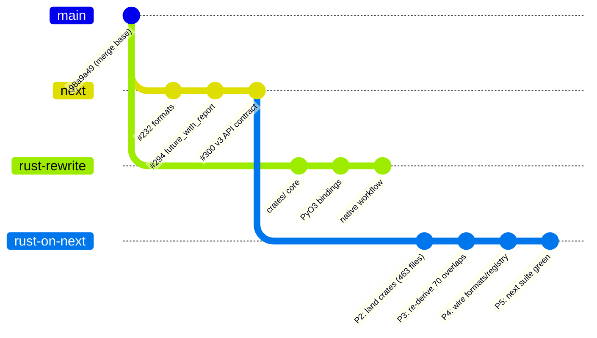
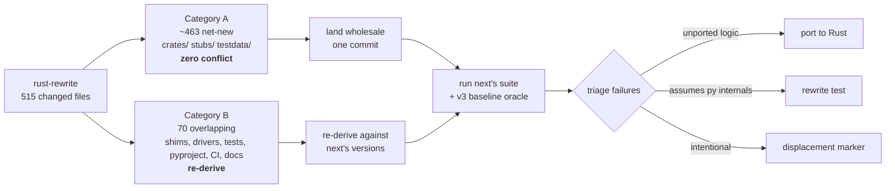

# Rebase the Rust rewrite onto `upstream/next`

## Status

- **Status:** Proposed
- **Owner:** rust-rewrite maintainers
- **Date:** 2026-09-07
- **Related:** [`rust-native-workflow-remediation.md`](rust-native-workflow-remediation.md),
  [`python-test-suite-trim.md`](python-test-suite-trim.md),
  upstream PRs #216, #232, #269, #285, #294, #300

This plan is temporary. On completion, route the durable pieces per
`docs/doc-taxonomy.md` (v3-compat contract → `docs/spec/`, rewrite rationale →
`docs/architecture/`) and archive this file.

## Problem Statement

The Rust rewrite was branched from `98a9a49` (2026-08-23), which is on the
`master` line. The real v4 integration target is `upstream/next`, which is at
`4.0.0b3` and has advanced **37 commits** since that merge base. The rewrite has
advanced **58 commits** in parallel.

`next` is not a quiet branch. It contains four new Python modules, a
restructured test suite, a restructured docs tree, and — most importantly — a
redefinition of the v4 public API contract (#300) backed by a byte-for-byte v3
parity oracle. None of this is reflected in the Rust rewrite.

Left unreconciled, the rewrite would ship a v4 that contradicts the v4 contract
`next` already published to beta users.

### Divergence at a glance

| Measure | Value |
|---|---|
| Merge base | `98a9a49` (2026-08-23) |
| `upstream/next` ahead | 37 commits |
| `rust-rewrite` ahead | 58 commits |
| Files changed on `next` | 191 |
| Files changed on `rust-rewrite` | 515 |
| **Textual overlap (path-identical)** | 52 files |
| **Overlap incl. next's renames** | **70 files** |
| Files we deleted that `next` touched | 1 (`poetry.lock`) |

The 70-file overlap is the entire conflict surface. The other 446 files we
changed are net-new (`crates/`, `stubs/`, `testdata/`, `Cargo.*`) and have no
counterpart on `next` at all.

> **Renames hide conflicts.** A plain path intersection reports only 52 files.
> `next` performed 73 renames while restructuring the suite — for example
> `tests/test_driver_cisco_ios.py` → `tests/integration/test_cisco_ios.py` and
> `tests/test_workflow.py` → `tests/unit/test_workflows.py`. Eighteen files the
> rewrite modified were moved rather than deleted, so they look net-new at their
> old path and would silently resurrect a deleted file if landed wholesale.
> Every comparison in this plan uses `git diff -M --find-renames=40%` and maps
> each of our paths through that rename table before classifying it.

### What `next` added that the rewrite lacks

| Upstream change | Impact on the rewrite |
|---|---|
| #300 restore v3 public names as permanent v4 API | **Contract change.** Native surface must expose v3 spellings. |
| #232 `formats.py` — JSON/XML/NETCONF/gNMI (552 lines) | Pure Python over the public tree API. Ports as-is. |
| `tree_algorithms.py` (349 lines) | Superseded ~1:1 by the Rust core. |
| #294 `future_with_report()` / `FutureReport` | **Genuinely absent from Rust.** Needs a native equivalent. |
| #295 uppercase registry keys, `registry.py`, `plugins.py` | Pure Python. Ports as-is. |
| #286 public post-load callbacks | Rule surface change; verify against driver rules. |
| #225 Fortinet negation hardening | Behavioural; must be mirrored in Rust driver rules. |
| Test suite → `tests/unit/` + `tests/integration/` | 8 flat files deleted, incl. two we modified. |
| #283/#288 docs restructure + v3→v4 migration guide | Collides with our `docs/dev/` and `docs/user/` edits. |

## Goals

1. Produce a branch whose diff base is `upstream/next`, not `master`.
2. Every logic change on `next` is either reflected in the Rust core, or
   consciously and visibly dropped with a recorded reason.
3. `next`'s test suite — including the 28-scenario v3 baseline — passes against
   the Rust core, or each failure carries a displacement marker.
4. The resulting diff is reviewable as "Rust rewrite applied to `next`".

## Non-Goals

- Preserving the 58-commit history of the rewrite. It is history against a
  stale base; it will be re-landed as a coherent series.
- Porting `formats.py` to Rust in this effort (see Phase 4 decision).
- Resolving performance regressions beyond the existing benchmark gate.

## Options Considered

### Option A — `git rebase --onto upstream/next`

Replay all 58 commits onto the new base.

**Rejected.** The rewrite reduced `base.py`, `root.py`, `child.py` and
`children.py` to re-export shims; `next` edited those same files as real logic.
Each of the 58 commits replays against the moved base, so the same
shim-vs-logic conflict is re-resolved up to 58 times. Worse, our test edits
replay onto paths `next` deleted in its restructure. This is the textbook worst
case for rebasing a rewrite.

### Option B — merge `next` into `rust-rewrite`

One merge commit, conflicts resolved once rather than per-commit.

**Rejected, but it is the only real competitor.** It correctly avoids the
N-times conflict problem. It fails on reviewability: the result tangles 58
rewrite commits with 37 upstream commits into a single unreviewable diff, and
it still requires hand-resolving all 70 overlapping files. It costs the same as
Option C and produces a worse artifact.

### Option C — fresh branch from `next`, re-land in two categories *(recommended)*

Branch `rust-on-next` from `upstream/next`. Land the ~463 net-new files
wholesale (zero conflict surface). Then re-derive the 70 overlapping files
against `next`'s versions rather than overwriting them.

**Accepted trade-off:** we lose the rewrite's commit history. That history has
little archaeological value — it documents work against a base we are
abandoning — and discarding it is precisely what avoids Option A's pain.

### Option D — do nothing

Ship the rewrite from `master`. **Rejected:** it would publish a v4 that
contradicts the v4 API contract already in beta on `next`, and silently drop
four modules of upstream feature work.

## Proposed Solution

Two insights drive the approach.

**The conflict surface is small and well-bounded.** 463 of 515 changed files are
net-new. They compile standalone and can land in one commit. Only 70 files need
human judgement.

**`next` handed us a better oracle than we had.** #300 shipped
`tests/fixtures/v3_baseline.json` plus 28 scenarios in
`tests/integration/v3_scenarios.py`, asserted byte-for-byte against a committed
v3.7.0 recording. Rather than hand-auditing 37 PRs as the *primary* mechanism —
37 subjective judgement calls — we port onto `next` and run `next`'s own suite
against the Rust core. Every failure is a concrete, located, unported logic
change. The per-PR walk is demoted to a residual audit for what tests cannot
catch: docs, performance, and API naming.

A convenient discovery: `next` refactored the core algorithms out of `base.py`
into `tree_algorithms.py` — isolating precisely the layer the Rust core owns.
The supersession is close to 1:1, and `formats.py` imports only `exceptions`,
`registry` and `root.HConfig`, so it sits cleanly on top of the native tree with
no Rust work required.

## Visual Overview

Category split driving the phases:

## Phased Implementation Plan

### Phase 1 — Establish the branch

**Scope:** Confirm `rust-rewrite` is fully committed. Create `rust-on-next` from
`upstream/next`.

**Acceptance criteria:**
- `git status --porcelain` on `rust-rewrite` is empty.
- `rust-on-next` exists with `upstream/next` as its merge base.
- `git log --oneline -1` matches `upstream/next` HEAD.

**Risks:** Losing uncommitted work. Mitigated by the clean-tree check.

### Phase 2 — Land Category A wholesale

**Scope:** Bring across every file with no counterpart on `next`: `crates/`,
`stubs/`, `testdata/`, `Cargo.toml`, `Cargo.lock`, new build scripts, plan docs.

**Acceptance criteria:**
- `cargo fmt --check`, `cargo clippy --all-targets --all-features -- -D warnings`
  and `cargo test --workspace` all pass.
- `maturin develop --release` builds the extension.
- No file touched in this phase appears in the 70-file overlap set.

**Risks:** A file mis-classified as net-new silently clobbers `next` work.
Mitigated by asserting the overlap set is disjoint before committing.

### Phase 3 — Re-derive the 70 overlapping files

**Sub-phase 3a — Python shim layer.** `base.py`, `root.py`, `child.py`,
`children.py`, `workflows.py`, `constructors.py`, `models.py`, `exceptions.py`.
Start from `next`'s version; re-apply the shim conversion on top. Do **not**
copy the `rust-rewrite` version over.

**Sub-phase 3b — Driver and view modules.** The 14 `platforms/` files in the
overlap set. Reconcile `next`'s rule changes (notably #225 Fortinet, #286 public
post-load callbacks) against the Rust driver rules.

> **Sizing finding (recorded during execution).** Diffing `next` against the
> merge base — rather than against the rewrite — shrinks this sub-phase
> dramatically. Per-driver deltas are only 7–32 lines and are almost entirely
> *mechanical*:
>
> 1. **Negation rule respelling (#220).** `NegationDefaultWhenRule` →
>    `NegationRule(strategy=DEFAULT)`, `NegationDefaultWithRule` →
>    `strategy=REPLACE`, `NegationSubRule` → `strategy=REGEX_SUB`. Semantics are
>    unchanged, and #300 kept the three v3 fields as permanent compat fields
>    resolved by `HConfigDriverRules.all_negation_rules()`. Every field name in
>    the Rust `rules.json` files (`negate_with`, `negation_default_when`, …)
>    still validates against `next`'s model, so **no Rust rules data has to
>    change** and no Rust engine change is required: the core already evaluates
>    REPLACE → DEFAULT → REGEX_SUB, which is the order `all_negation_rules()`
>    reproduces.
> 2. **Public post-load callbacks (#286).** Private callbacks were renamed
>    public (`_remove_ipv4_acl_remarks` → `remove_ipv4_acl_remarks`). The
>    rewrite runs the built-in post-load pipeline in Rust, so these functions
>    have no Python home. They must be **re-exposed as public Python functions**
>    operating on the public node API to preserve the v4 API surface, even
>    though the built-in pipeline still executes natively.
> 3. **`view_class` driver attribute.** Each driver now declares its view class.
>
> **Residual divergence needing a decision:** `next`'s `driver_base` documents
> `negate_with()` as an overridable imperative hook; the rewrite's
> `__init_subclass__` *rejects* subclasses defining it (only rule data crosses
> into Rust). This is a real API incompatibility, not a mechanical rename.
>
> **Known caveat:** for a hand-written v4 `negation` list that *interleaves*
> DEFAULT and REGEX_SUB rules, `next` evaluates them in list order whereas the
> Rust core evaluates all DEFAULT before all REGEX_SUB. Rules folded from the v3
> fields are unaffected (they are already grouped), so no shipped driver
> diverges — but a native single ordered negation list would be required for
> full fidelity.

**Sub-phase 3c — Build and CI config.** `pyproject.toml`, `mkdocs.yml`,
`.github/workflows/*`. Merge `next`'s test-path restructure with our maturin
build. Delete `poetry.lock`.

**Sub-phase 3d — Docs and agent instructions.** `AGENTS.md`, `CLAUDE.md`,
`.github/copilot-instructions.md`, `CONTRIBUTING.md`, `README.md`, `docs/**`.
`next`'s restructure wins on layout; our Rust content is folded into it.

**Acceptance criteria:**
- Every one of the 70 files is individually accounted for.
- `python scripts/build.py lint` exits 0.
- `mkdocs build --strict` passes.
- No `next` feature is silently reverted (verified by Phase 5).

**Risks:** Highest-judgement phase. Silent reversion of `next` behaviour is the
main hazard; Phase 5 is the backstop.

### Phase 4 — Wire the new `next` modules onto the native tree

**Scope:**
- `formats.py`, `registry.py`, `plugins.py` — keep as pure Python. Confirmed
  safe: `formats.py` imports only `exceptions`, `registry`, `root.HConfig`.
- `tree_algorithms.py` — delete; superseded by the Rust core.
- `future_with_report()` / `FutureReport` (#294) — **implement natively.** This
  is the one genuinely-new algorithm with no Rust counterpart.

**Acceptance criteria:**
- `tests/unit/test_formats.py` passes unmodified.
- `future_with_report()` returns `unresolved_negations` and
  `idempotency_replacements` referencing nodes in the returned future tree.
- `tree_algorithms.py` is gone with no remaining importers.

**Risks:** `FutureReport` nodes must reference the *returned* tree so `path()`
and `lineage()` work — this constrains the native implementation to build the
report during, not after, future computation.

### Phase 5 — Run `next`'s suite against the Rust core

**Scope:** Run `tests/unit/` and `tests/integration/`, including
`test_v3_baseline.py`. Triage every failure into exactly one bucket:

1. **Unported logic** → port to Rust.
2. **Test asserts Python internals** → rewrite the test against the public API.
3. **Intentional divergence** → record via `scripts/check_displacement_markers.py`.

**Acceptance criteria:**
- `python scripts/build.py lint-and-test` exits 0.
- All 28 v3 baseline scenarios match byte for byte.
- Every displacement marker names the upstream PR it diverges from and why.
- Coverage floor (88%) held without loosening.

**Risks:** The v3 baseline may expose systemic divergence, not point failures.
If so, escalate before adding markers — markers must not paper over a design gap.

### Phase 6 — Residual per-PR audit

**Scope:** Walk the 37 `next` commits. For each, record: *mirrored in Rust* /
*not applicable* / *consciously dropped, reason*. Focus on what tests cannot
catch — docs accuracy, benchmark deltas, public-name spelling.

**Acceptance criteria:**
- All 37 commits have a recorded disposition.
- `CHANGELOG.md` reconciled — including correcting our `(#216)` references,
  which collide with upstream #216 "Rename inconsistent public APIs".
- `pytest -m benchmark tests/benchmarks/test_perf_regression.py` passes.

## Testing Strategy

| Phase | Verification |
|---|---|
| 1 | `git status --porcelain`; merge-base assertion |
| 2 | `cargo fmt --check`; `cargo clippy --all-targets --all-features -- -D warnings`; `cargo test --workspace`; `maturin develop --release` |
| 3 | `python scripts/build.py lint`; `mkdocs build --strict` |
| 4 | `pytest tests/unit/test_formats.py -v`; new native `future_with_report` tests (Rust + Python) |
| 5 | `python scripts/build.py lint-and-test`; `pytest tests/integration/test_v3_baseline.py -v` |
| 6 | `pytest -m benchmark tests/benchmarks/test_perf_regression.py -v -s` |

The v3 baseline (`tests/fixtures/v3_baseline.json`, 28 scenarios) is the
primary acceptance oracle for the whole effort. Per repo TDD policy, Phase 4's
native `future_with_report` starts with a failing test in both `cargo test` and
pytest.

## Observability

n/a — this is a library with no runtime telemetry surface. The observable
signals are CI job outcomes and the benchmark regression gate, both of which
already exist and are covered in the Testing Strategy.

## Security Considerations

**PCI scope: out-of-scope.** `hier_config` is an offline text-processing library
for network device configurations; it opens no sockets, touches no cardholder
data, and performs no authentication or authorization. This migration is a
branch-reconciliation exercise that changes no trust boundary.

Two implications are worth naming despite the out-of-scope classification:

- **XML parsing.** `formats.py` uses `xml.etree.ElementTree` with a lint
  suppression, and is carried over unchanged from `next`. Untrusted XML input
  remains the caller's responsibility. This plan neither improves nor worsens
  that stance; it is flagged so the carry-over is a conscious decision rather
  than an accident.
- **Memory safety.** Moving the core to Rust removes a class of memory-safety
  concern rather than adding one. The PyO3 boundary uses no `unsafe` blocks
  authored by this project.

Security stance: **neutral**. No new dependencies, no new I/O, no new
privileges. Team baseline applies as documented in
`security.instructions.md` (installed in `.github/instructions/` by
`sync-instructions`).

## Cross-references

- [`rust-native-workflow-remediation.md`](rust-native-workflow-remediation.md) —
  the native `WorkflowRemediation` work being carried onto the new branch.
- [`python-test-suite-trim.md`](python-test-suite-trim.md) — displacement-marker
  conventions reused in Phase 5.
- `scripts/check_displacement_markers.py` — enforcement for intentional
  divergence.
- `docs/dev/architecture.md` — layering the re-derived shims must preserve.

## Open Questions

- [x] Rebase, merge, or fresh branch? — resolved: fresh branch from `next`
      (Option C); rebase re-resolves the same conflict up to 58 times.
- [x] Does `formats.py` need a Rust port? — resolved: no. It imports only
      `exceptions`, `registry` and `root.HConfig`, so it operates on the native
      tree unchanged.
- [x] What happens to `tree_algorithms.py`? — resolved: delete it; the Rust core
      supersedes it ~1:1, except `compute_future_with_report`.
- [ ] Should the v3 compatibility aliases (#300) be implemented in the native
      surface or as a thin Python delegation layer? Python delegation is
      cheaper and matches upstream's own "delegate, don't copy" rationale, but
      puts the v3 spellings a Python call away from the fast path.
- [x] Does the rewrite's `4.0.0` version become `4.0.0b4`, or does landing the
      Rust core justify going straight to `4.0.0`? — resolved: `4.0.0b4`. The
      Rust core is a large enough change to warrant another beta on the existing
      `next` prerelease line rather than cutting the final release.
- [x] Are any of the 8 test files `next` deleted worth resurrecting because the
      Rust core reintroduces behaviour they covered? — resolved: no, by default.
      Their coverage moved into `tests/unit/` and `tests/integration/`. Phase 5
      revisits only if the `next` suite leaves a Rust-specific behaviour
      uncovered and the coverage floor cannot otherwise be met.
